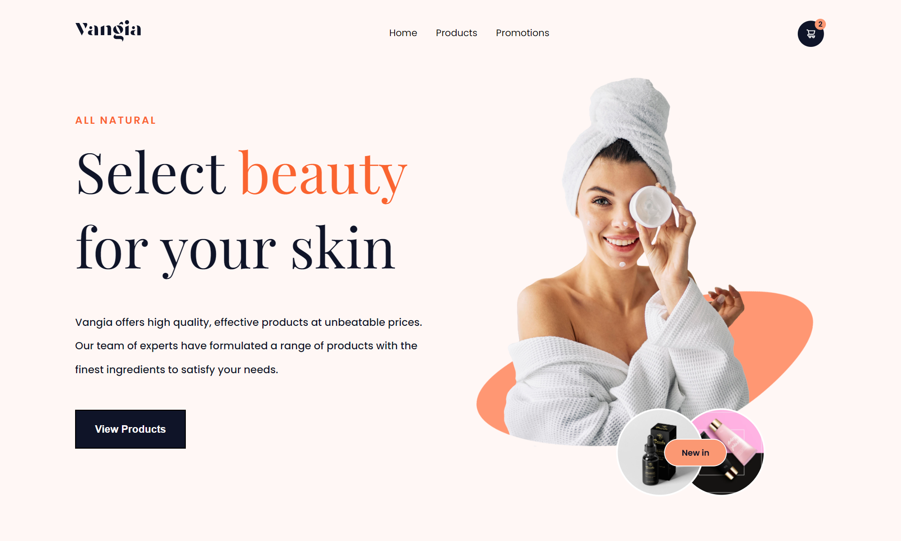

# Responsive Front End Website for Vangia Cosmetics Landing Page using React JS
This project is a single page web front end for Vangia Cosmetics using the React JS framework. I created this project as an exercise to develop front end skills

## Table of contents

- [Overview](#overview)
  - [The challenge](#the-challenge)
  - [Screenshot](#screenshot)
  - [Links](#links)
- [My process](#my-process)
  - [Built with](#built-with)
  - [What I learned](#what-i-learned)
  - [Continued development](#continued-development)
  - [Useful resources](#useful-resources)
- [Author](#author)
- [Acknowledgments](#acknowledgments)


## Overview

### The challenge

- Build out the project to the designs provided
- Adding slider for the testimonial section

### Screenshot



### Links
- [Live Site URL](https://clever-seahorse-070928.netlify.app/)

## My process

### Built with

- Semantic HTML5 markup
- CSS custom properties
- Flexbox
- CSS Grid
- [React JS](https://reactjs.org/) - JS library
- [React Icons](https://react-icons.github.io/react-icons/) - JS library to add icons
- [Swiper js](https://swiperjs.com/) - JS library that creates modern touch sliders with hardware-accelerated transitions


### What I learned

Use this section to recap over some of your major learnings while working through this project. Writing these out and providing code samples of areas you want to highlight is a great way to reinforce your own knowledge.

To see how you can add code snippets, see below:

```html
<h1>Some HTML code I'm proud of</h1>
```
```css
.proud-of-this-css {
  color: papayawhip;
}
```
```js
const proudOfThisFunc = () => {
  console.log('🎉')
}
```

If you want more help with writing markdown, we'd recommend checking out [The Markdown Guide](https://www.markdownguide.org/) to learn more.


### Continued development
in the near future I will continue the development of this project by adding functionality to the cart, and implementing infinite scrolling in the product section


### Useful resources
- [Figma Web Design & elements i used for this project is published by Dmm Kreativ](https://ui8.net/dmm-kreativ/products/uniquepages?status=7)
- [UI/UX Design Resources](https://ui8.net/) - This website provide many UI/UX design some are free. I really liked this website and will use it going forward.
- [Example resource 2](https://www.example.com) - This is an amazing article which helped me finally understand XYZ. I'd recommend it to anyone still learning this concept.


## Author

- Github - [Shabrina Putri](https://github.com/shabrina12/)
- Instagram - [@shabputri_](https://www.twitter.com/yourusername)


## Acknowledgments

This is where you can give a hat tip to anyone who helped you out on this project. Perhaps you worked in a team or got some inspiration from someone else's solution. This is the perfect place to give them some credit.

